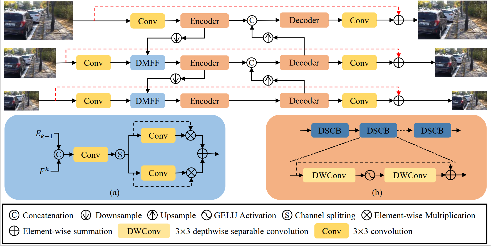
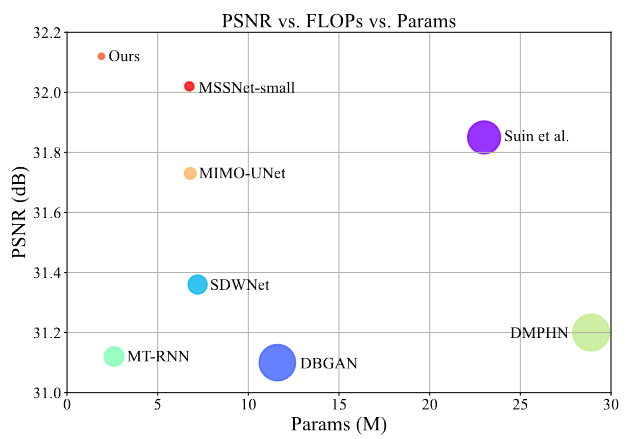

# Lightweight Deep Deblurring Model with Discriminative Multi-scale Feature Fusion
## News
paper link:https://ieeexplore.ieee.org/document/10222723

Paper has been accepted by ICIP2023
## Abstract
Although existing learning-based deblurring methods achieve significant progress, these approaches tend to require lots of network parameters and huge computational costs, which limits their practical applications. 
Instead of pursuing larger deep models for boosting deblurring performance, we propose a lightweight deep convolutional neural network with lower computational costs and comparable restoration performance, which is based on a multi-scale framework with an encoder and decoder network architecture.
Specifically, we present an effective depth-wise separable convolution block (DSCB) as the fundamental building block of our method to reduce the model complexity.
In addition, to better utilize the features from different scales, we develop a simple yet effective discriminative multi-scale feature fusion (DMFF) module for achieving high-quality results. 
Experimental results on the benchmarks show that our method is about $10\times$ smaller than the state-of-the-art deblurring methods, MPRNet, in terms of model parameters and FLOPs while achieving competitive performance. 
## Architecture

## Eval
```python eval.py```
## Performance

## Requirement
see requirements
```pip install -r requirements.txt```
## Acknowledgment
This code is based on the MIMO-UNet and BasicSR
